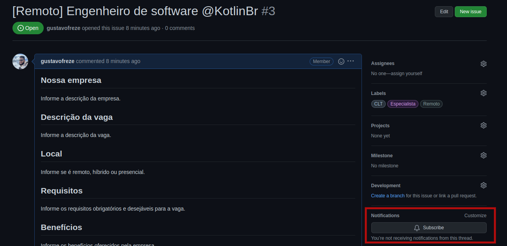

# Vagas

<!--suppress HtmlDeprecatedAttribute -->

Espaço para a divulgação de vagas para desenvolvedores Kotlin via issues do Github.

## :office: Como cadastrar uma vaga?

Abra uma [issue](https://github.com/kotlin-br/vagas/issues/new), e no título, coloque o **local**,
seguido da **descrição da vaga**, e **nome da empresa**. Siga o modelo padrão gerado pela issue.

Adicionalmente, informe quais labels devemos adicionar, contendo o nível de experiência desejada e a forma de contração.

#### Importante :heavy_exclamation_mark:

Com o objetivo de manter a qualidade das vagas postadas e respeitar todas as pessoas e empresas, **NÃO ACEITAMOS**:

1. Vagas sem o nome da empresa.
2. Vagas de terceiros que não informem o nome da empresa na qual o(a) candidato(a) irá trabalhar.
3. Vagas com informações faltantes e/ou fora do [modelo da issue](./.github/ISSUE_TEMPLATE/adicionar-nova-vaga.md).
4. Mais do que 2 (duas) vagas IGUAIS da mesma empresa POR MÊS.

❗️ **Caso algum desses itens seja infringido, a moderação poderá alertar na issue ou até mesmo a vaga poderá ser DELETADA sem aviso prévio.**

_OBS.: Sabemos que é dificil controlar todas essas regras, portanto pedimos que nos ajudem e que tenham bom senso_

### ⚠️ Cuide da sua vaga ;)

Para evitar que possíveis candidatos enviem CVs para vagas já preenchidas, dê manutenção à sua issue, a cada 3 meses, coloque um comentário que continua procurando para a vaga ou feche a mesma comentando se a pessoa foi contratada através do nosso grupo ou por fora. Caso a issue passe de 3 meses e não tiver manutenção, a mesma poderá ser fechada por um moderador do repositório.

### 🔔 Como receber atualizações das vagas?

Você pode receber atualizações das vagas no seu e-mail ou via notificações do GitHub, basta clicar **Subscribe**, na
issue que você tem interesse.

    
     
    <tl>Ativar notificações.</tl>

### :octocat: Outros repositórios de vagas

Esse repositório é específico para vagas de **React Native**.
Existem vagas para muitas outras áreas nesse mercado sendo compartilhadas por outras comunidades, algumas pessoas
da comunidade forkaram o repositório do FrontEndBR e criaram outras listas específicas
para diferentes _stacks_ e estados do país. Confira abaixo as outras
listas onde você poderá postar sua vaga também:

#### Por área

- [Vagas para desenvolvedores Back-End](https://github.com/backend-br/vagas)
- [Vagas para desenvolvedores Front-End](https://github.com/frontendbr/vagas)
- [Vagas para desenvolvedores Chat-Bot](https://github.com/chatbotbr/vagas)
- [Vagas para Data Science](https://github.com/datascience-br/vagas)
- [Vagas para UI/UX](https://github.com/uxbrasil/vagas)
- [Vagas para QAs](https://github.com/qa-brasil/vagas)

#### Por tecnologia

- [Vagas para desenvolvedores Android](https://github.com/androiddevbr/vagas)
- [Vagas para desenvolvedores iOS e OSX](https://github.com/CocoaHeadsBrasil/vagas)
- [Vagas para desenvolvedores PHP](https://github.com/phpdevbr/vagas)
- [Vagas para desenvolvedores Python](https://github.com/pydevbr/vagas)
- [Vagas para desenvolvedores Vue.js](https://github.com/vuejs-br/vagas)
- [Vagas para desenvolvedores Go/Golang](https://github.com/Gommunity/vagas)
- [Vagas para desenvolvedores Flutter](https://github.com/flutter-brazil/vagas)
- [Vagas para desenvolvedores React/React Native](https://github.com/react-brasil/vagas)
- [Vagas para desenvolvedores React Native](https://github.com/react-native-drops/vagas)
- [Vagas para desenvolvedores NestJS](https://github.com/NestBR/vagas)
- [Vagas para desenvolvedores .NET](https://github.com/dotnetdevbr/vagas)
- [Vagas para desenvolvedores Rust](https://github.com/rustdevbr/vagas)
- [Vagas para desenvolvedores Elm](https://github.com/FidelisClayton/elm-jobs)
- [Vagas para desenvolvedores Kotlin](https://github.com/kotlin-br/vagas)

#### Por localidade

- [Vagas para desenvolvedores no Ceará](https://github.com/CangaceirosDevels/vagas_de_emprego)
- [Vagas para desenvolvedores em Feira de Santana/Bahia](https://github.com/devfsa/vagas)
- [Vagas para desenvolvedores React no Rio de Janeiro](https://github.com/reactrio/vagas)
- [Vagas para desenvolvedores Front-end (Angola)](https://github.com/frontend-ao/vagas)
- [Vagas para desenvolvedores Back-end (Angola)](https://github.com/backend-ao/vagas)
- [Vagas para desenvolvedores Front-end (Portugal)](https://github.com/frontend-pt/vagas)
- [Vagas para desenvolvedores Back-end (Portugal)](https://github.com/backend-pt/vagas)

## :copyright: Licença

Licenciado sob [MIT](/LICENSE).
